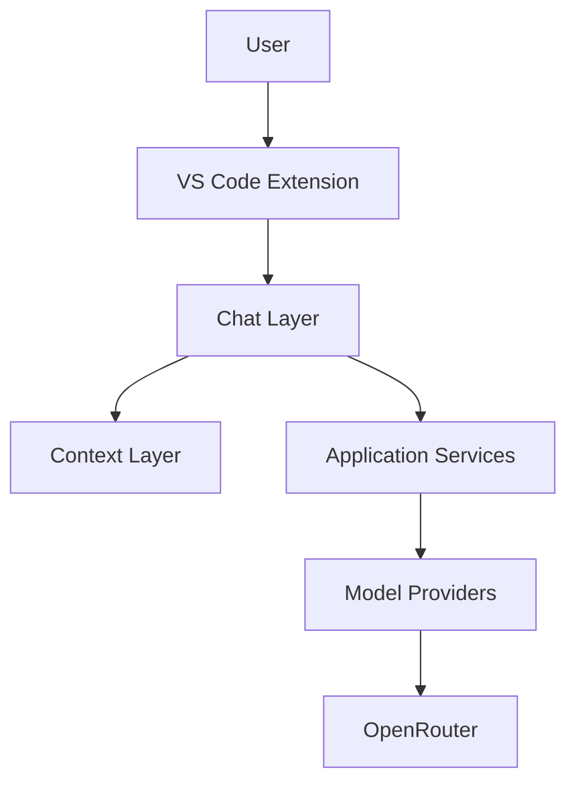
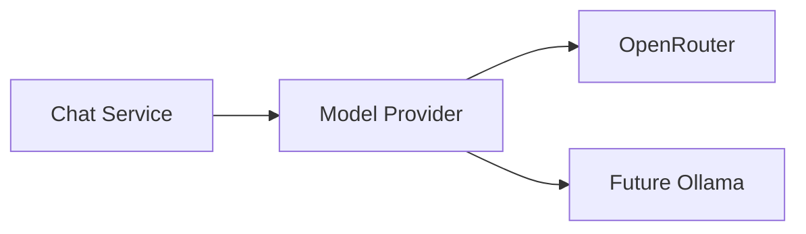
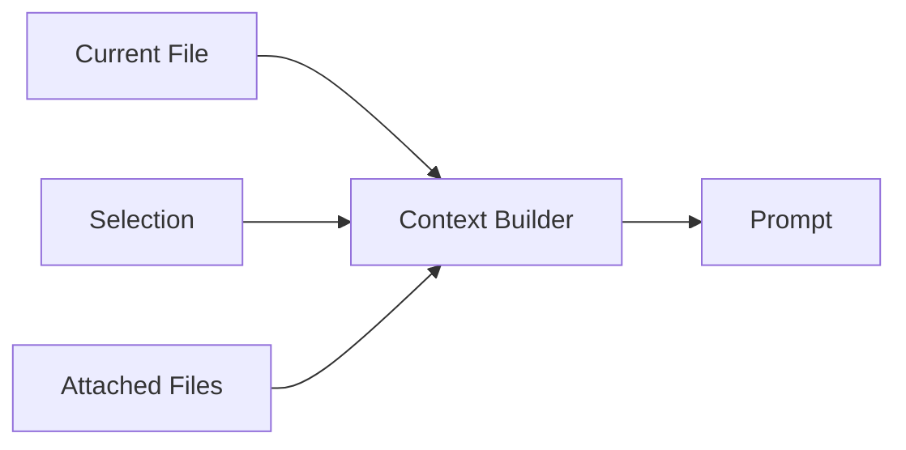
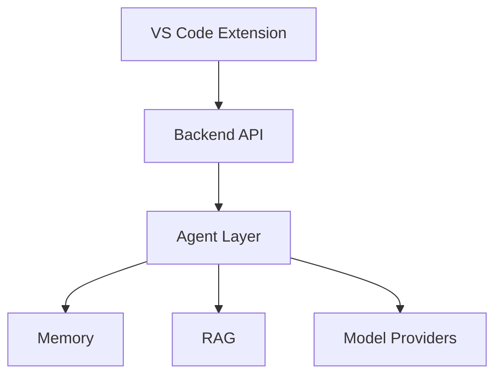

# AI Coding Assistant Architecture

## Overview

This project aims to build a practical AI coding assistant that evolves incrementally from a simple chat-based coding helper into an agentic coding assistant capable of repository exploration, code modification, memory, and RAG.

The architecture follows a pragmatic approach:

- Build the simplest useful solution first.
- Delay complexity until it provides clear value.
- Favor maintainability over architectural purity.
- Keep the project usable at every stage.

---

# Architectural Philosophy

## Core Principles

### KISS

Keep solutions simple.

Avoid introducing infrastructure before it is needed.

---

### YAGNI

Do not build systems for future requirements.

Features should be implemented when they solve a current problem.

---

### DRY

Avoid unnecessary duplication.

Do not introduce abstractions prematurely.

---

### SRP

Modules should have a single responsibility.

---

### Composition Over Inheritance

Favor composition and dependency injection.

Keep inheritance shallow.

---

### Testability

Business logic should be easily testable.

Design for testing from the beginning.

---

# Evolution Strategy

The project intentionally evolves through several stages.


A dedicated backend is intentionally postponed until complexity justifies the separation.

---

# Current Architecture (v0.x)

Initially, the entire application lives inside the VS Code extension.



This architecture minimizes complexity while enabling rapid iteration.

---

# Repository Structure

```text
.
├── .codex
├── .github
├── .husky
│
├── docs
│   ├── roadmap.md
│   ├── architecture.md
│   └── adrs
│
├── memory
│   ├── decisions.md
│   ├── conventions.md
│   ├── lessons-learned.md
│   └── architecture-summary.md
│
├── src
│   │
│   ├── extension
│   │
│   ├── chat
│   │
│   ├── context
│   │
│   ├── models
│   │
│   ├── services
│   │
│   ├── types
│   │
│   └── utils
│
├── tests
│
├── AGENTS.md
│
├── package.json
├── tsconfig.json
└── README.md
```

---

# Source Structure

## extension

VS Code integration layer.

Responsibilities:

- Register commands
- Register views
- Activate extension
- UI integration

Avoid placing business logic here.

---

## chat

Conversation management.

Responsibilities:

- Chat sessions
- Message handling
- Response streaming
- Chat orchestration

---

## context

Workspace context collection.

Responsibilities:

- Current file context
- Selected text context
- Attached files
- Workspace metadata

Future responsibilities:

- Repository indexing
- Context compression

---

## models

LLM provider abstraction.

Responsibilities:

- Model communication
- Provider implementations
- Request execution

Example:

```text
ModelProvider
 └── OpenRouterProvider
```

Future:

```text
ModelProvider
 ├── OpenRouterProvider
 └── OllamaProvider
```

---

## services

Business logic layer.

Responsibilities:

- Prompt construction
- Chat execution
- Context assembly
- Future memory orchestration

This is where most application logic should live.

---

## types

Shared TypeScript types.

Responsibilities:

- Interfaces
- DTOs
- Shared type definitions

---

## utils

Generic utility functions.

Avoid placing business logic here.

---

# Dependency Direction

Dependencies should flow downward.

```text
extension
    ↓
chat
    ↓
services
    ↓
models

context
    ↓
services

types
    ↑
shared
```

Business logic should never depend on UI components.

---

# Model Layer

The application communicates with LLMs through a provider abstraction.



Benefits:

- Easier testing
- Future provider support
- Local/cloud routing

---

# Context Pipeline

Context should be assembled consistently.



Future additions:

- Memory
- RAG retrieval
- Workspace search

---

# Testing Strategy

## Unit Tests

Primary focus.

Test:

- Context builders
- Prompt builders
- Services
- Model routing
- Memory logic

Avoid testing model responses.

---

## Integration Tests

Test:

- OpenRouter integration
- VS Code integration
- End-to-end chat flow

---

# Documentation Strategy

Formal documentation:

```text
docs/
```

Includes:

- Roadmap
- Architecture
- ADRs

---

Project memory:

```text
memory/
```

Includes:

- Decisions
- Conventions
- Lessons learned

These files act as long-term context for both developers and AI agents.

---

# Future Backend Extraction

A backend should only be introduced once the project includes:

- Tool calling
- Persistent memory
- RAG
- Agent workflows

At that point the architecture evolves into:



This migration should be evolutionary rather than a complete rewrite.

---

# Success Criteria

The architecture is successful if:

- The assistant remains usable throughout development.
- Features can be added incrementally.
- Complexity grows only when justified.
- Major rewrites are avoided.
- The system remains understandable to both humans and AI coding agents.
